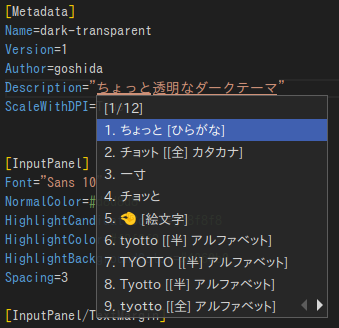

# fcitx5-theme-dark-transparent

A slightly transparent dark theme for Fcitx5.




## Usage

### Installation

```bash
git clone https://github.com/goshida/fcitx5-theme-dark-transparent.git
mkdir -p ~/.local/share/fcitx5/themes/
cp -r ./fcitx5-theme-dark-transparent/dark-transparent ~/.local/share/fcitx5/themes/
```

### Enabling

Set the theme by editing `~/.config/fcitx5/conf/classicui.conf` or using GUI.

```dosini
Theme=dark-transparent
```

And restart Fcitx5 using following command or GUI.

```bash
fcitx5 -r -d
```


## LICENSE

See [LICENSE](LICENSE).

